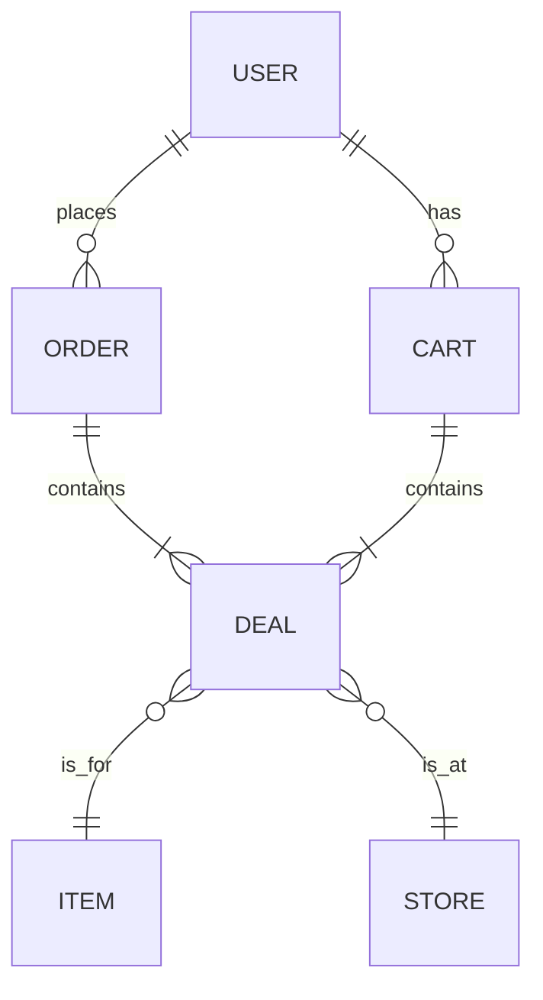

# Data Model: FreshCycle

**Purpose**: To define the key data entities for the FreshCycle feature based on the feature specification.

## Entity Relationship Diagram (ERD)

## Entity Definitions

### User
Represents the app user.
- **Attributes**:
    - `userId` (string, PK)
    - `name` (string)
    - `email` (string)
    - `paymentMethods` (array) - *Details out of scope for this document.*
    - `orderHistory` (array of Order)

### Store
Represents a supermarket partner.
- **Attributes**:
    - `storeId` (string, PK)
    - `name` (string)
    - `address` (string)
    - `location` (object) - `{ lat: number, lon: number }`

### Item
Represents the product itself.
- **Attributes**:
    - `itemId` (string, PK)
    - `name` (string)
    - `description` (string)
    - `images` (array of string URLs)
    - `allergens` (array of string)
    - `ingredients` (string)

### Deal
Represents a discounted item for sale. It links an `Item` to a `Store` with pricing and availability.
- **Attributes**:
    - `dealId` (string, PK)
    - `itemId` (string, FK to Item)
    - `storeId` (string, FK to Store)
    - `originalPrice` (number)
    - `discountedPrice` (number)
    - `expiryTimestamp` (ISO 8601 string)
    - `quantity` (number)

### Cart
A temporary collection of deals a user intends to purchase. The cart state will be stored on the client.
- **Attributes**:
    - `items` (array of object) - `[{ dealId: string, quantity: number }]`
    - `lastUpdated` (ISO 8601 string)

### Order
A confirmed purchase of one or more deals from a single store.
- **Attributes**:
    - `orderId` (string, PK)
    - `userId` (string, FK to User)
    - `storeId` (string, FK to Store)
    - `deals` (array of object) - `[{ dealId: string, quantity: number, priceAtPurchase: number }]`
    - `status` (string) - e.g., "Paid", "Ready for Pickup", "Completed", "Cancelled"
    - `qrCode` (string) - A unique string to be rendered as a QR code.
    - `pickupWindow` (object) - `{ start: ISO 8601, end: ISO 8601 }`
    - `createdAt` (ISO 8601 string)
